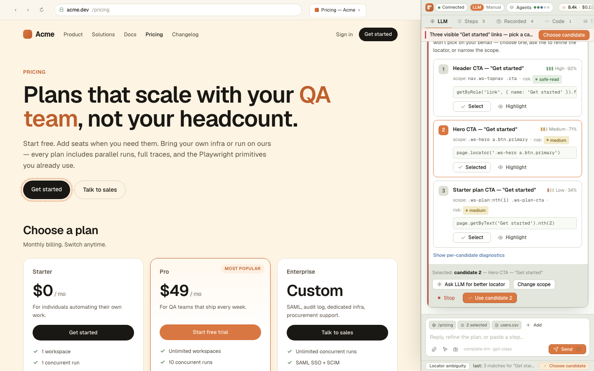
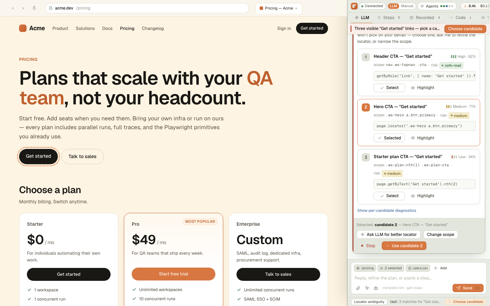

# Checkpoint Demo — Complete LLM Mode UI

**Date:** 2026-05-15
**Branch:** `s7/clusters-6-11-complete-llm-mode`
**Captured via:** `scripts/capture_checkpoint_demo.py` (Playwright + Chromium headless 1440×900)
**Source surface:** `AutoWorkbench.html` (canonical mock / smoke harness)

---

## Purpose

Manual-test checkpoint screenshots demonstrating every reachable UI state of
the Complete LLM Mode panel.  Each PNG was captured with a canonical
`window.AW.lastEvent` payload injected into the live React app so the card
renders its live-binding branch, not just the static mock fallback.

---

## Screenshot grid

### LLM tab — 17 card states

| # | State | Screenshot | What it demonstrates |
|---|-------|------------|----------------------|

| 1 | `idle` |  | No session active. Shows the empty-state prompt with suggestion chips. |
| 2 | `planning` |  | Backend is scanning the page. Shows the LLM reasoning bubble. |
| 3 | `clarify` |  | Backend emitted clarification_needed. CardClarification shows depth options. |
| 4 | `recommend` |  | Backend emitted recommendation_ready. CardRecommendation shows assertion checklist. |
| 5 | `plan` |  | Backend emitted plan_ready. CardPlanReady shows 6 steps awaiting confirmation. |
| 6 | `diff` |  | LLM proposed a plan diff. CardPlanDiff shows +1/-1 changes awaiting acceptance. |
| 7 | `permit` |  | Backend emitted permission_required. CardPermission shows allow/deny for a CTA click. |
| 8 | `exec` |  | Backend emitted step_executing. CardExecution shows live progress with pause/stop. |
| 9 | `locator` |  | Backend emitted locator_candidates_ready. CardLocatorAmbiguity shows candidate picker. |
| 10 | `recover` |  | Backend emitted recovery_needed_structured. CardRecovery shows failure details + repair. |
| 11 | `done` |  | Backend emitted run_completed. CardCompleted shows summary with replay/save actions. |
| 12 | `offline` |  | Transport lost. CardOffline shows reconnect options and held-state notice. |
| 13 | `schema` |  | LLM returned invalid plan JSON. CardSchemaError shows field path + repair button. |
| 14 | `nobrowser` |  | Backend up but no Playwright context. CardNoBrowser shows launch options. |
| 15 | `apikey` |  | No API key in workspace. CardApiKey shows add-key and workspace-key options. |
| 16 | `otp` |  | Step hit a 2FA prompt. CardOtp shows 6-digit code input with skip option. |
| 17 | `e2e` |  | Local run succeeded. CardCompleted + CardE2EPending shows nightly E2E gate. |

### Secondary tabs — 4 tabs

| # | Tab | Screenshot | What it demonstrates |
|---|-----|------------|----------------------|
| 1 | `tab_steps` |  | Steps tab with 5 pending steps showing locator status and intent. |
| 2 | `tab_recorded` |  | Recorded tab with 4 parent steps and child operations/evidence. |
| 3 | `tab_code` |  | Code tab showing generated Playwright spec with copy/export actions. |
| 4 | `tab_trace` |  | Trace tab with event timeline, LLM calls, locator decisions and failure details. |

---

## Checklist

- [ ] All 17 LLM card states render without blank areas or JS errors
- [ ] Live-binding branch activates (card header shows "live" badge) for: clarify, recommend, plan, permit, exec, locator, recover, done, offline, schema, nobrowser, apikey
- [ ] Composer is visible and usable in every LLM state
- [ ] Steps tab shows step cards with locator status badges
- [ ] Recorded tab shows parent steps with child operations
- [ ] Code tab shows generated spec with copy/export actions
- [ ] Trace tab shows event timeline with filter controls
- [ ] No `console.error` or unhandled React warnings in any state
- [ ] Screenshots are 1440×900, panel occupies right third of viewport

---

_Generated by `scripts/capture_checkpoint_demo.py` — do not edit by hand._
